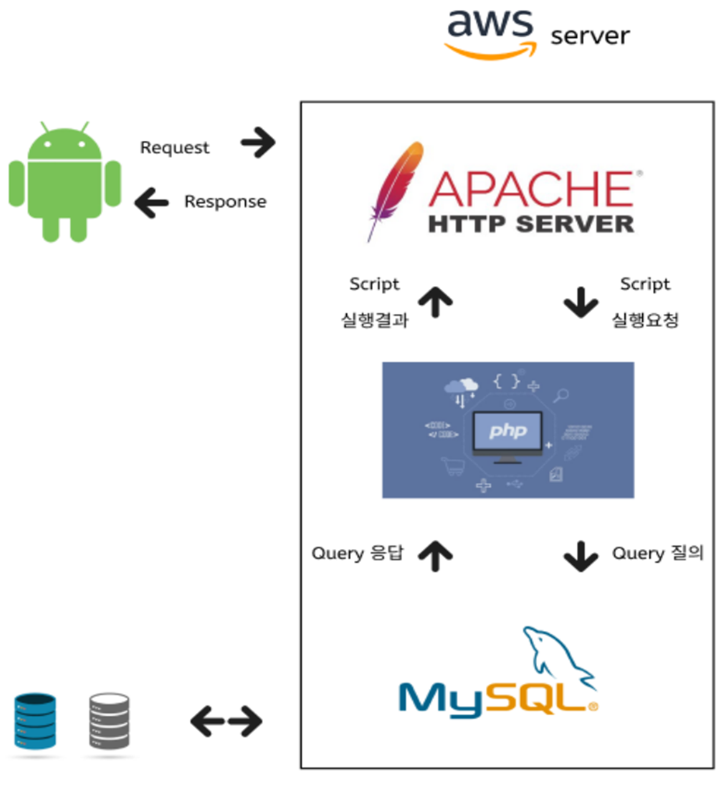

# [미듬]

### 해당 서비스는 2024 경주 지역문제 해결 해커톤 [TEAM 얼큰돼지국밥]의 프로젝트 입니다.

---
## 서비스 소개
### [미듬]
- 미듬은 경주시가 선별한 장기공실매물들을 청년들에게 소개 및 연결시켜주는 어플리케이션입니다.

---
## 기능(예시)

- 회원가입 기능, 안드로이드 스튜디오을 사용하여 이름, 메일, 전화번호, 비밀번호, 생년월일를 입력
- 아파치 웹서버를 통해 mysql 데이터베이스에 회원정보 저장.
- 

---
## 서비스 아키텍처(예시)

---
## 사용 기술(예시)
| **Category**         | **Technologies** |
|----------------------|-------------|
| **Frontend**         | html, XML , java(android studio)       |
| **Backend**          | PHP, apache, mysql |
| **devops**           | AWS   |
| **Others**           | Github, Figma |

---
## 팀원 소개
| **팀원 이름**            | **팀원 이름** | **팀원 이름** | **팀원 이름** |
|----------------------|----------|-----------|---------|
| 팀장(Leader), Frontend | Frontend | Backend, devops | Backend |
